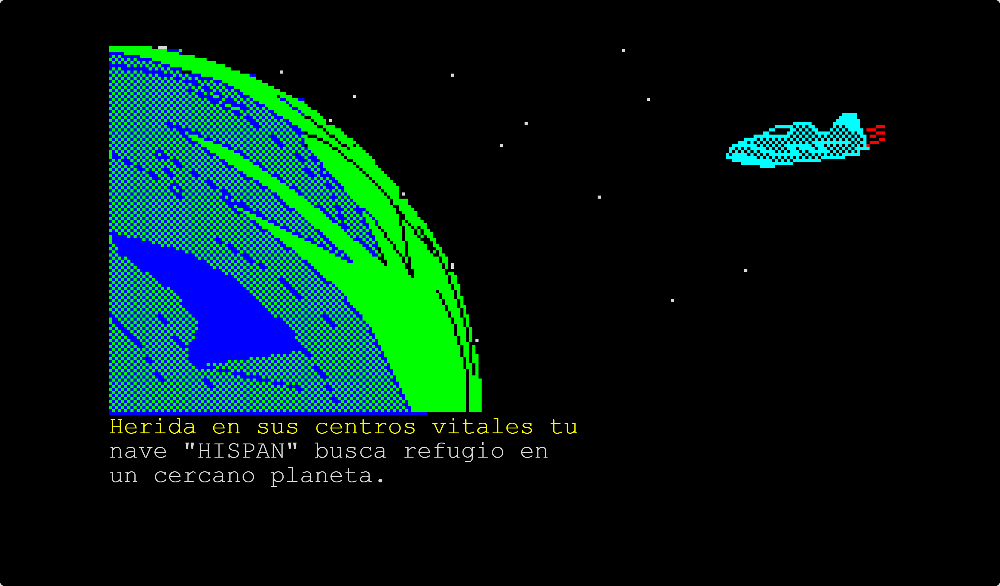
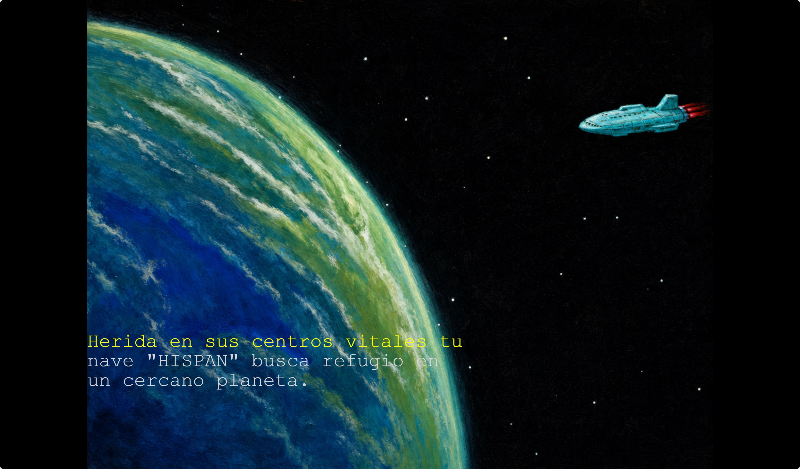
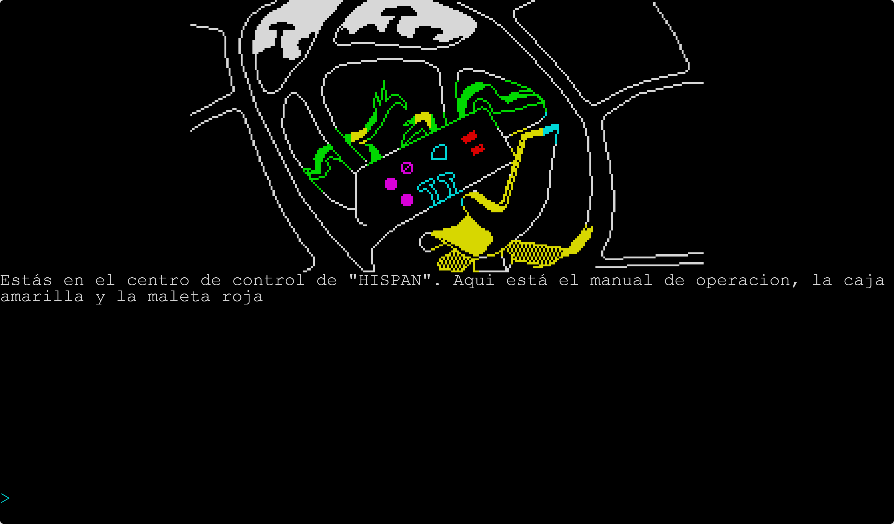
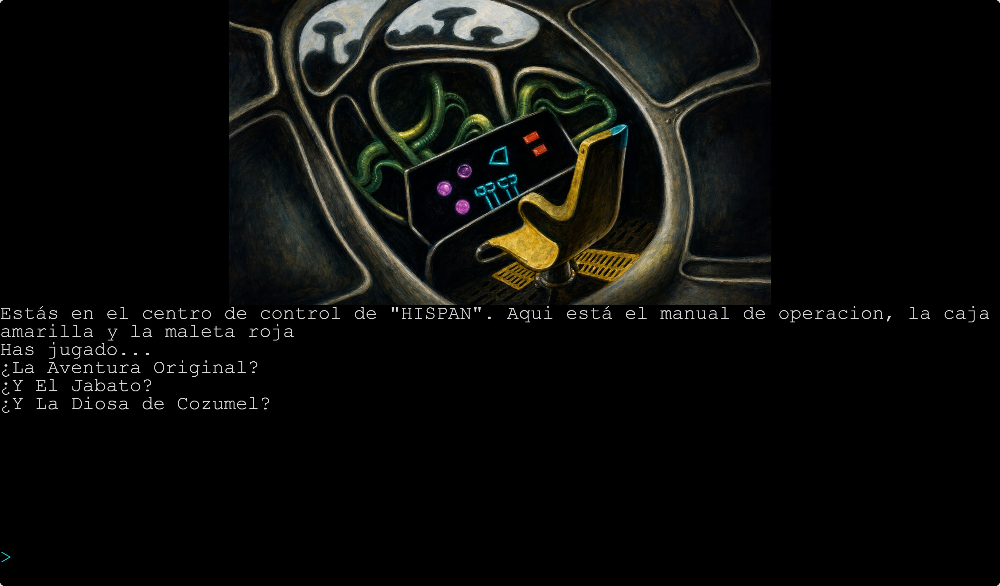
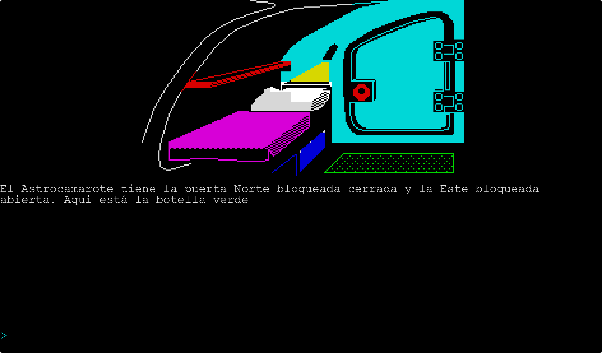
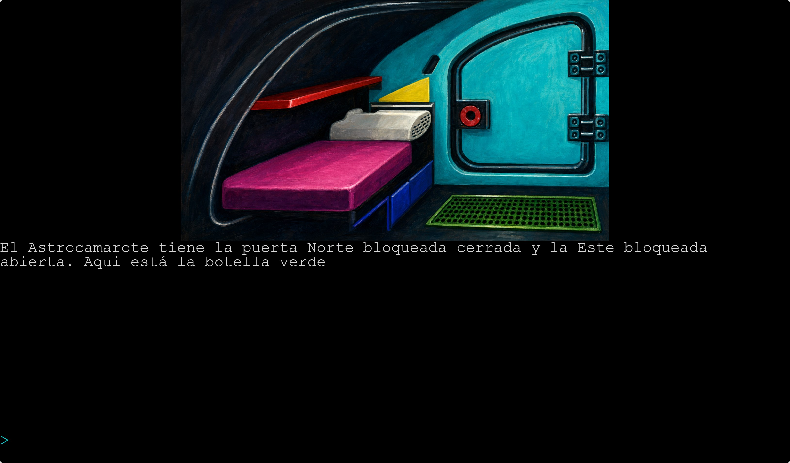

# PAWS-AI

A modern, Ruby-based interpreter for classic ZX Spectrum text adventures written
with the **PAWS** (Professional Adventure Writing System) engine by Graeme
Yeandle and Tim Gilberts. PAWS-AI can load a game directly from its original
snapshot (`.sna`, `.z80`, `.sp`, `.tap`) or from a portable JSON description
extracted from that snapshot, and run it either in the terminal or in a
browser-based UI with optional AI-assisted parsing, AI-enhanced graphics, and
an interactive debugger.

### Firfurcio — original vs. AI-enhanced graphics

Three locations from the Spanish adventure **Firfurcio** rendered with PAWS-AI.
On the left, the deterministic ZX Spectrum frames produced by the engine; on
the right, the same scenes regenerated with the `ai-painting` graphics mode.

| Original graphics (rendered by PAWS-AI) | AI-enhanced graphics (`ai-painting`) |
|------------------------------------------|--------------------------------------|
|  |  |
|  |  |
|  |  |

## Features

- **Drop-in interpreter for PAWS snapshots.** Loads `.sna`, `.z80`, `.sp`
  and `.tap` files directly. The first run extracts a portable JSON
  description; subsequent runs reuse it.
- **Two front-ends.** A terminal client (`bin/play`) optimised for terminal and
  debugging, and a web client (`bin/web`) that renders Spectrum-style graphics
  in the browser.
- **AI-powered parser.** When the original VERB + NAME vocabulary is too
  strict, an optional LLM-backed parser translates free-form player input
  (`"hit the guard with the weapon"`) into the canonical command the
  adventure expects.
- **AI-powered graphics.** Swap the deterministic Spectrum location frames for
  on-demand or pregenerated AI artwork in several styles (pixel art, painting,
  cartoon, realistic) without changing game logic.
- **Adventure translation.** Extract a game and translate its text into another
  language with the same AI provider, keeping runtime structures (process ids,
  condact params, connections, vocabulary indices) untouched.
- **Interactive debugger.** Live flag/object/location inspection, breakpoints
  on condacts, locations, flags and object positions, single-stepping,
  state-history snapshots with rewind, and a remote web debugger.
- **Transcripts and autoplay.** Record a play session to a file, replay it as
  an integration test, or use it to drive reproducible regression runs.

## Installation

### Requirements

- Ruby 3.x
- Bundler
- (Optional) Docker, for the containerised web UI

### Install dependencies

```bash
bundle install
```

### Docker (web UI only)

The image ships with the runtime gems and the bundled example game
**El Espía** (`games/espia.sna`, `games/espia.json`, `games/espia.mapping.json`,
`games/espia_en.json`). `bin/web` listens on `0.0.0.0:4567` and can be
launched straight away without mounting anything:

```bash
docker build -t paws-ai .
docker run --rm -p 4567:4567 paws-ai games/espia.sna
```

To run your own games instead, mount a `games/` directory and pass the
path to the snapshot or extracted JSON as the container command:

```bash
docker run --rm -p 4567:4567 \
  -v "$PWD/games:/app/games:ro" \
  paws-ai games/your-game.sna
```

Change the published port with `--port`:

```bash
docker run --rm -p 8080:8080 -v "$PWD/games:/app/games:ro" \
  paws-ai --port 8080 games/espia.sna
```

Mount `/app/cache` whenever you use an AI graphics mode so generated images
survive between container runs:

```bash
docker run --rm -p 4567:4567 \
  -v "$PWD/games:/app/games:ro" \
  -v "$PWD/cache:/app/cache" \
  paws-ai --graphics-mode ai-pixelart games/espia.sna
```

To invoke any of the other CLI tools, override the entrypoint with `bundle`:

```bash
docker run --rm --entrypoint bundle paws-ai exec bin/extract --help
docker run --rm -it -v "$PWD/games:/app/games:ro" \
  --entrypoint bundle paws-ai exec bin/play games/espia.sna
```

## Quick start

A working example game — **El Espía** — ships with the public repository at
`games/espia.sna`, so the integration specs run out of the box on a fresh
clone. Launch the terminal client right away:

```bash
bundle exec bin/play games/espia.sna
```

Or the web client, and open `http://localhost:4567`:

```bash
bundle exec bin/web games/espia.sna
```

To exercise the engine against your own collection, place additional
`.sna`, `.z80`, `.sp` or `.tap` files alongside `espia.sna` and point the
CLI tools at them the same way. Everything in `games/` other than the
`espia*` example is ignored by `.gitignore` and stays local.

PAWS-AI extracts the snapshot into a JSON description on the fly the first
time it sees a file. If you already have a JSON file, pass it directly:

```bash
bundle exec bin/play games/espia.json
```

When a `.json` is supplied, PAWS-AI loads it as-is and does **not** re-extract
the original snapshot or apply any mapping file. Mappings are only consulted
when extracting from `.sna`/`.z80`/`.sp`/`.tap`.

## Command-line tools

All tools accept snapshot paths, `.json` paths, or both. Snapshot paths are
extracted transparently the first time they are used.

### `bin/play` — terminal front-end

```text
Usage: play [options] <game_file.json|.sna|.z80|.sp|.tap>
```

| Option | Description |
|--------|-------------|
| `-C`, `--colors` | Render text with Spectrum-style colours. |
| `-v`, `--verbose` | Increase verbosity (repeat up to 3 times: events, condacts, full state changes). |
| `-S`, `--skip-clear-screen` | Skip clearing the terminal on `CLS` (useful when debugging scrollback). |
| `-P`, `--parser-mode MODE` | `original` (default) or `ai`. |
| `-m`, `--mapping PATH` | Character mapping JSON used when extracting the snapshot. |
| `-F`, `--flags-desc-file PATH` | Text file with human-readable flag descriptions (format: `ID Description`). |
| `-B`, `--breakpoints-file PATH` | Load breakpoints from a file (see Debugging). |
| `-d`, `--debug` | Start in stepping mode and pause at the first condact. |
| `--debug-bind HOST`, `--debug-port PORT` | Expose the web debugger on the given host/port. |
| `-H`, `--history-size N` | Capacity of the time-travel history buffer in debug mode (default 200). |
| `-R`, `--record-commands PATH` | Append every player command to this file (one per line). |
| `-T`, `--transcript PATH` | Write the visible text transcript (no graphics) to this file. |
| `-a`, `--autoplay PATH[:RANGE]` | Replay a previously recorded command file. Ranges are `all` or `n-m`. |

### `bin/web` — browser front-end

```text
Usage: web [options] <game_file.json|.sna|.z80|.sp|.tap>
```

| Option | Description |
|--------|-------------|
| `-b`, `--bind HOST` | Bind host (default `127.0.0.1`). |
| `-p`, `--port PORT` | HTTP port (default `4567`). |
| `-P`, `--parser-mode MODE` | `original` (default) or `ai`. |
| `-g`, `--graphics-mode MODE` | `original` (default), `ai-painting`, `ai-pixelart`, `ai-realistic`, `ai-cartoon`, or `disabled`. |
| `-G`, `--graphics-cache` | Reuse cached AI images; do not generate missing ones. |
| `-r`, `--text-renderer MODE[:SIZE]` | Screen text renderer: `pc` (default) or `spectrum`. Optional PC font size in pixels, e.g. `pc:26`. |
| `-v`, `--verbose` | Increase verbosity (repeat up to 3 times). |
| `-S`, `--skip-clear-screen` | Skip clearing the web transcript/screen on `CLS`. |
| `-m`, `--mapping PATH` | Character mapping JSON used when extracting the snapshot. |
| `-F`, `--flags-desc-file PATH` | Text file with human-readable flag descriptions. |
| `-B`, `--breakpoints-file PATH` | Load breakpoints from a file. |
| `-d`, `--debug` | Enable the `!debug` web command for the remote debugger. |
| `--debug-bind HOST`, `--debug-port PORT` | Expose the web debugger on the given host/port. |
| `-H`, `--history-size N` | Capacity of the time-travel history buffer in debug mode. |
| `-R`, `--record-commands PATH` | Append every player command to this file. |
| `-T`, `--transcript PATH` | Write the visible text transcript to this file. |
| `-a`, `--autoplay PATH[:RANGE]` | Replay a recorded command file. |

The web client connects to the local engine through a WebSocket. Game state
runs exclusively on the Ruby backend — the browser only renders frames and
forwards input. Each `PICTURE`/condact sequence renders into a Spectrum screen
model on the backend, which is then published as a PNG frame at native
256×192 resolution and scaled losslessly in the browser.

### `bin/extract` — snapshot → JSON

```text
Usage: extract [options] <sna_file> [output.json]
```

| Option | Description |
|--------|-------------|
| `-m`, `--mapping PATH` | Character mapping JSON to use during extraction. |
| `--generate-mapping PATH` | Generate a mapping file before extracting. |
| `--generate-mapping-mode MODE` | `heuristic` (default) or `ai`. |
| `-o`, `--output PATH` | Output path (alternative to the positional argument). |
| `--translate-from LANG` | Optional source language hint for translation. |
| `--translate-to LANG` | Translate the extracted game data to the target language. |
| `--translation-report PATH` | Save a JSON report with glossary, batches and validation metadata. |
| `--translation-batch-chars N` | Approximate source-text characters per translation batch. |

### `bin/pregenerate-ai-graphics` — prebuild AI location art

```text
Usage: pregenerate-ai-graphics [options] <game_file.json|.sna|.z80|.sp|.tap>
```

| Option | Description |
|--------|-------------|
| `--ai-graphics-style STYLE` | `pixelart` (default), `cartoon`, `realistic` or `painting`. |
| `--force` | Regenerate images even when cache files already exist. |
| `--cache-root PATH` | Cache directory (default `cache/`). |
| `-m`, `--mapping PATH` | Character mapping JSON used when extracting the snapshot. |

Images are written to `cache/<game>/<style>/picN.jpg`, the same path the web
client reads when launched with `--graphics-mode ai-*`.

## Configuration

All AI features share an OpenAI-compatible chat endpoint and read their
settings from environment variables.

### Local CLI

For local development, copy `.env.example` to `.env` and fill in the
values you need. `bin/play`, `bin/web`, `bin/extract --generate-mapping-mode ai`,
`bin/extract --translate-to`, and `bin/pregenerate-ai-graphics` all load this
file automatically. Exported shell variables override `.env`.

```env
# AI parser (--parser-mode ai)
AI_PARSER_API_KEY=your_api_key_here
AI_PARSER_ENDPOINT=https://openrouter.ai/api/v1
AI_PARSER_MODEL=provider/model

# AI graphics (--graphics-mode ai-*)
AI_GRAPHICS_PROVIDER=openai
AI_GRAPHICS_API_KEY=your_api_key_here
AI_GRAPHICS_ENDPOINT=https://api.openai.com/v1/images/edits
AI_GRAPHICS_MODEL=gpt-image-2
```

### Docker

Pass the values directly with `-e`, one per variable. Container
environment takes priority over the local `.env` (which is not even
read inside the image). The `.dockerignore` excludes `.env` so the
file is never baked into the build:

```bash
docker run --rm -p 4567:4567 \
  -e AI_PARSER_API_KEY=your_api_key_here \
  -e AI_PARSER_ENDPOINT=https://openrouter.ai/api/v1 \
  -e AI_PARSER_MODEL=provider/model \
  -v "$PWD/games:/app/games:ro" \
  paws-ai games/espia.sna --parser-mode ai
```

For longer variable lists, `--env-file` is also supported and is
useful when the same `.env` is shared with local CLI runs:

```bash
docker run --rm -p 4567:4567 --env-file .env \
  -v "$PWD/games:/app/games:ro" \
  paws-ai games/espia.sna --parser-mode ai
```

But note: the `bin/web` script *inside* the container only checks the
process environment, not the file. The `--env-file` form therefore
relies on Docker's own expansion of that file into the container's
environment before the entrypoint runs.

## Character mapping

Many Spanish PAWS games repurpose printable Spectrum characters to represent
accented letters, `ñ`, opening punctuation, or other game-specific glyphs.
PAWS-AI exposes three modes for handling this:

- **Default extraction.** If you pass no mapping options, the extractor uses a
  built-in default table that maps common bytes (`@`, `$`, `%`, `&`, `#`,
  `\`, `|`, `[`, `` ` ``, `^`) to their usual Spanish glyphs. It never calls
  the AI.

- **Manual mapping.** Pass `--mapping PATH` with your own JSON mapping file
  when you already know the charset. Keys can be a single literal character
  (`"$"`) or a decimal byte code as a string (`"64"`):

  ```json
  {
    "64": "á",
    "$":  "í",
    "123": "{"
  }
  ```

  When a mapping value is non-ASCII, the extractor preserves the original byte
  using a glyph placeholder such as `m{glyph:45:ú}sica`. CLI output, web
  transcripts and other readable renderers show the fallback (`música`);
  the web Spectrum renderer can still use byte `45` with the active extracted
  charset. You can also write a placeholder directly in the mapping file to
  keep an ASCII-looking fallback while preserving the byte:

  ```json
  { "64": "{glyph:64:@}" }
  ```

- **Mapping generation.** Pass `--generate-mapping PATH` (and optionally
  `--generate-mapping-mode ai`) to ask the extractor to write a first
  proposal. The default `heuristic` mode never calls the AI: it performs a
  temporary extraction with an empty mapping, scans the locations, messages,
  system messages, object names, abbreviations, and vocabulary, and writes
  suspicious observed bytes as conservative glyph placeholders such as
  `{glyph:64:@}`. Review the generated file, replace clear cases with the
  intended characters, then re-extract with `--mapping`:

  ```bash
  bundle exec bin/extract --generate-mapping games/game.mapping.json games/game.sna game.json
  bundle exec bin/extract --mapping games/game.mapping.json games/game.sna game.json
  ```

Mappings are only applied when extracting from a snapshot. If you launch
`bin/play` or `bin/web` with a `.json` file, the engine reads the JSON
directly and ignores `--mapping`.

## AI parser

The original PAWS parser accepts a fixed VERBO + NOMBRE pair that the author
had to anticipate. With `--parser-mode ai`, PAWS-AI asks a language model to
interpret free-form input against the game's vocabulary, recent history and
inventory, and emits the canonical command the adventure expects.

```bash
bundle exec bin/play --parser-mode ai games/espia.sna
```

The engine sends the recent transcript, the player's inventory and the active
vocabulary; the model returns the intended command (e.g.
`"hit the guard with the weapon" → ATACA GUARDIA`). The adventure logic is
never modified.

## AI graphics

`bin/web` can replace the deterministic Spectrum location frames with
AI-enhanced artwork while preserving the original PAWS composition. Available
modes are `ai-painting`, `ai-pixelart`, `ai-realistic` and `ai-cartoon`.

On-demand generation works out of the box, but generates a new image every
time you revisit a location. To save API credits and speed up subsequent
runs, pregenerate the cache first:

```bash
bundle exec bin/pregenerate-ai-graphics --ai-graphics-style pixelart games/espia.sna
bundle exec bin/web --graphics-mode ai-pixelart games/espia.sna
```

Use `--force` to overwrite existing cache files and `--cache-root PATH` to
write to a different directory. With `--graphics-cache`, the web client
reuses cached images and does not generate missing ones.

## Adventure translation

`bin/extract --translate-to` asks the same AI provider to translate the
extracted text into another language while keeping runtime structures
untouched. Process ids, condact params, connections, graphics, and the
five-character command-stem rule for vocabulary rows stay exactly as in the
original; only translatable text changes.

Translation requires an explicit character mapping so the model receives the
cleanest possible source text. Generate one first or in the same command:

```bash
bundle exec bin/extract \
  --generate-mapping games/game.mapping.json \
  --translate-from es --translate-to en \
  games/game.sna game.en.json
```

`--translation-report PATH` saves a JSON report with the glossary, the
batches the model was asked about, and validation metadata. Lower
`--translation-batch-chars N` if the provider truncates JSON for long
sections.

## Debugging

PAWS-AI ships with a console debugger (in `bin/play`) and a remote web
debugger (in `bin/web` or any front-end started with `--debug-bind` /
`--debug-port`).

### Breakpoints

A breakpoint file is a plain text file with one spec per line. Lines starting
with `#` or `;` are comments.

| Spec | Meaning |
|------|---------|
| `P1` | Pause at the start of Process 1 (Block 0, Condact 0). |
| `P1B5` | Pause at the start of Block 5 of Process 1. |
| `P1B*` | Pause at the start of every block of Process 1. |
| `P1B5C8` | Pause at Condact 8 of Block 5. |
| `P1B5C*` | Pause at every condact in Block 5. |
| `P1B*C*` | Pause at every condact of every block (maximum detail). |
| `L10` | Pause on entering location 10. |
| `F8` | Pause when Flag 8 changes to any value. |
| `F8=7` | Pause when Flag 8 changes to 7. |
| `F8>7`, `F8<7` | Pause when Flag 8 changes through the comparison. |
| `O1=H` | Pause when Object 1 moves to the player's location (`HERE`). |
| `O1=10` | Pause when Object 1 moves to location 10. |

```bash
bundle exec bin/play -B games/espia.breakpoints games/espia.sna
```

### Verbosity levels

- `-v` — high-level events: location changes, player input.
- `-vv` — condact execution, formatted as `LET(71,34)`, `EQ(...) -> ok`, etc.
- `-vvv` — full detail, including flag changes and `CLS`/`ANYKEY`
  synchronisation.

### Console debugger commands

When a breakpoint is reached, the engine drops into an interactive REPL:

```text
DEBUG (f:flags, t:stack, p:code, s:step, b:break, db:del, c:cont, x:exit, ?:help) >
```

| Command | Description |
|---------|-------------|
| `f[n]` | Show non-zero/known flags, or a specific flag (`f60`). |
| `sf` | Show all system flags (0-59). |
| `uf` | Show all user flags (60-255). |
| `kuf` | Show only known user flags (named in your `--flags-desc-file`). |
| `f<n>=<v>` | Set flag `n` to value `v` (e.g. `f8=10`). |
| `vb=<n>` | Change verbosity level (0-3). |
| `t` | Show the current process call stack trace. |
| `p [spec]` | Show code of the current process/block, or a specific one (`p p2b3`). |
| `s` | Execute a single condact and pause. |
| `b <spec>` | Add a dynamic breakpoint (e.g. `b p3b1c5`, `b f8=10`, `b o1=here`). |
| `pb` | List all active breakpoints. |
| `db <n>` | Delete breakpoint number `n`. |
| `c` | Continue execution until the next breakpoint. |
| `x` (or `exit`) | Abort the current process and return to the prompt. |
| `l=<n>` | Jump the player to location `n` (e.g. `l=5`). |
| `o<n>=<loc>` | Move object `n` to location `loc` (`o1=here`, `o5=10`). |
| `e` | Show engine state (location, referred object, …). |
| `l[n]`, `m[n]`, `sys[n]`, `o[n]`, `v[n]`, `con[n]` | Inspect locations, messages, system messages, objects, vocabulary, connections (defaults to current location). |
| `hist` | List state-history snapshots with `[idx]` indices. |
| `hist <idx>` | Show details of the snapshot at `idx`. |
| `rewind <idx>` | Restore game state to snapshot `idx` and prune newer ones. |
| `undo` | Rewind to the previous snapshot and prune newer ones. |
| `?` | Show the help message. |
| `q`, `quit` | Quit the game. |

### Remote web debugger

Expose the debugger through HTTP with `--debug-bind` and `--debug-port`:

```bash
bundle exec bin/web --debug-bind 0.0.0.0 --debug-port 5678 games/espia.sna
docker run --rm -p 4567:4567 -p 5678:5678 \
  -v "$PWD/games:/app/games:ro" paws-ai \
  --debug --debug-bind 0.0.0.0 --debug-port 5678 games/espia.sna
```

The browser console at `http://localhost:5678` exposes the same commands as
the console debugger and accepts the same breakpoint spec language.

### Time-travel debugging

Every turn, the engine captures a snapshot of the complete state (turn count,
location, input, flags). `hist` lists them with stable, 0-based `[idx]`
identifiers. `undo` and `rewind <idx>` load the requested state and **prune
all subsequent history**, so the timeline stays linear with no branching.
The default buffer holds 200 snapshots; raise it with `-H N`.

## Transcripts and autoplay

`-R PATH` records every player command to a file (one per line). `-T PATH`
writes the visible text transcript without graphics. Both files are valid
inputs for `-a` (autoplay):

```bash
bundle exec bin/play -R games/session.commands games/espia.sna
# … play a session …
bundle exec bin/play -a games/session.commands games/espia.sna
```

Use ranges to replay a slice of a transcript:

```bash
bundle exec bin/play -a games/session.commands:all games/espia.sna
bundle exec bin/play -a games/session.commands:10-25 games/espia.sna
```

Transcripts double as integration tests: any change to the engine that
diverges from a previously recorded playthrough fails fast, so a clean replay
is a strong regression signal.

## Flag descriptions

To make flag dumps more readable, provide a plain text file mapping each flag
id to a label (`#`-prefixed lines are comments):

```text
# games/espia.flags
63 Ammunition (Bullets)
64 Don's Location
```

Then run with `-F`:

```bash
bundle exec bin/play -vv -F games/espia.flags games/espia.sna
```

## Save games

Inside a running game the engine accepts the standard PAWS RAMSAVE/RAMLOAD
condacts. The web client exposes save/load slots; the terminal client uses
the same store.

## License

PAWS-AI is released under the MIT License. See `LICENSE` for the full text
and `AUTHORS` for a list of people who have contributed.

The bundled example game **El Espía** (`games/espia.*`) is part of this
release and is released under the same MIT License. All other ZX Spectrum
snapshots (`.sna`, `.z80`, `.sp`, `.tap`) are **not** part of this release:
they remain the property of their respective rights holders, are ignored
by `.gitignore`, and you must supply your own copies under `games/` before
running them through the engine.
